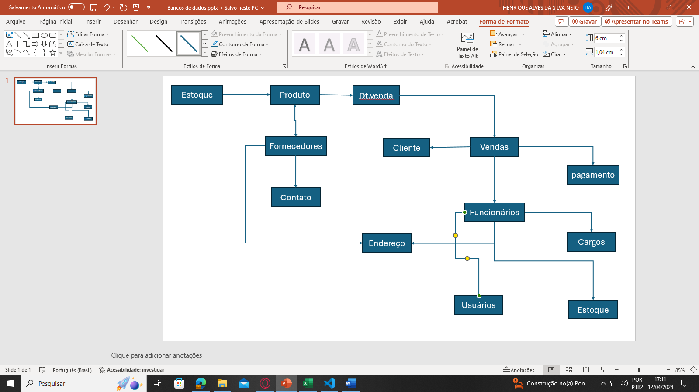
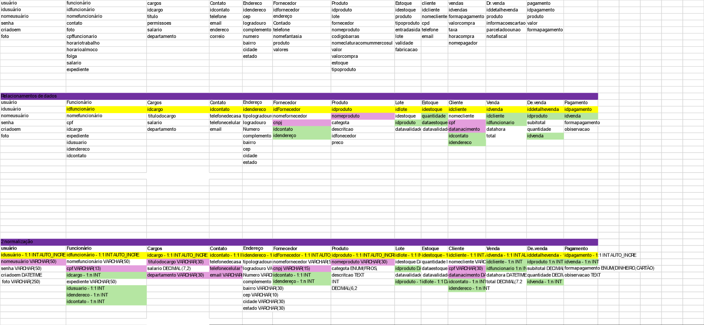
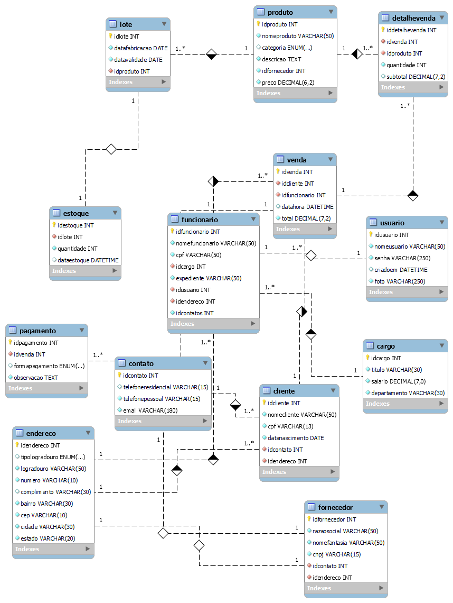

# Estudo de caso da casa Oliveira
## Desenvolvimento das modelagens do estudo de caso
### o estudo de caso
Casa Oliveira
Roberto é dono de um mercado no bairro de Vargem Grande, na cidade de 
Tupã. Ele herdou o negócio de seu pai, Gumercindo Oliveira, ela foi aberta em 
1978 na garagem da casa da família, era uma pequena quitanda. Com o passar 
dos anos o negócio cresceu e Gumercindo foi obrigado a ir para outro ponto 
maior e ali permaneceu até os dias atuais.

Roberto, que agora é o novo dono do mercado continuou o negócio seguindo 
da mesma forma que o pai. Ele comprava diretamente com os fornecedores 
grandes volumes de produtos e armazenava em seu estoque. As vezes ele 
comprava muitos produtos que ainda havia em estoque causando uma 
sobrecarga de produtos, ele também tinha muitos produtos estragados, tais 
como: frutas, legumes, iogurtes, leites, frango etc. Também havia muitos 
produtos com o prazo de validade vencido.

Os funcionários eram poucos e faziam muitas coisas ao mesmo tempo. O 
açougueiro também ajudava no estoque, a moça da limpeza ajudava na 
organização dos produtos das prateleiras, além de ajudar na padaria, quanto o 
caixa estava vazio o operador ajudava a repor os laticínios e a limpar a loja. O 
repositor também fazia operação no caixa.

Ao realizar a venda o Roberto, que sabia o nome de quase todos os clientes, 
anotava em um caderno todos os produtos que vendia e que havia em estoque. 
Ao fim do dia , Roberto pegava o caderno de fazia os cálculos de o quanto 
havia vendido, somando o faturamento e realizando a atualização do estoque. 
Isso é feito todos os dias e toma um tempo considerável para que tudo seja 
feito.

Roberto fechava a loja as 18h, mas só ia para casa as 22h, após fazer todas as 
operações necessárias. Mesmo assim o negócio vai bem e Roberto pretende ir 
para outro ponto e aumentar o volume de negócios e contratar novos 
funcionários.

Marica, esposa de Roberto, vem conversando com ele há muito tempo para que 
ele contrate uma empresa para construir um sistema de informática para 
gerenciar o negócio e reduzir o tempo que ele passa trabalhando e tenha maior 
organização dos produtos, maior lucratividade e melhorar a gestão.
Com a intenção de aumentar o negócio, Roberto está disposto a informatizar 
sua empresa. Vamos ajudá-lo. Iremos começar construindo o banco de dados

#### Antidades levantadas

Casa Oliveira – Mercado 


Banco de dados Mercado

-Estoque
-Produto
-Vendas
-Detalhes das vendas
-Cliente
-Funcionários 
-Cargos
-Usuário 
-Fornecedor
-pagamento

##### Diagrama casa oliveira


#### Esquema de tabela para banco de dados



#### modelo Fisico: codigo que gera o banco de dados 

```sql
-- Comando para criar um novo banco de dados. 
CREATE DATABASE casaoliveira;
-- comando para selecionar o banco de dados criado
USE casaoliveira;

-- Comando para a criação de tabelas
CREATE TABLE usuario(
idusuario int auto_increment primary key,
nomeusuario varchar(50) not null unique,
senha varchar(255) not null,
criadoem datetime default current_timestamp(),
foto varchar(250) not null
);
CREATE TABLE funcionario(
idfuncionario int auto_increment primary key,
nomefuncionario varchar(50) not null,
cpf varchar(13) not null unique,
idcargo int not null,
expediente varchar(50) not null,
idusuario int not null,
idendereco int not null,
idcontato int not null
);

CREATE TABLE cargo(
idcargo int auto_increment primary key,
titulocargo varchar(30) not null unique,
salario decimal(7,2) not null,
departamento varchar(30) not null unique
);
CREATE TABLE contato(
idcontato int auto_increment primary key,
telefoneresidencial varchar(15),
telefonecelular varchar(15) not null unique,
email varchar(100) not null unique
);
CREATE TABLE endereco(
idendereco int auto_increment primary key,
tipologradouro enum("Rua","Avenida","Travessa","Estrada","Viela","Praça","Alameda"),
logradouro varchar(50) not null,
numero varchar(10) not null,
complemento varchar(30),
bairro varchar(30) not null,
cep varchar(10) not null,
cidade varchar(30) not null,
estado varchar(20) not null
);

CREATE TABLE fornecedor(
idfornecedor int auto_increment primary key,
razaosocial varchar(50) not null unique,
nomefantasia varchar(50) not null,
cnpj varchar(15) not null unique,
idcontato int not null,
idendereco int not null
);

CREATE TABLE produto(
idproduto int auto_increment primary key,
nomeproduto varchar(50) not null unique,
categoria enum("Frios","Limpeza","Laticinios","Cereais","Açougue","Bebidas","Pães","Hortifruti"),
descricao text not null,
idfornecedor int not null,
preco decimal(6,2) not null
);

CREATE TABLE lote(
idlote int auto_increment primary key,
datafabricacao date not null,
datavalidade date not null,
idproduto int not null
);

CREATE TABLE estoque(
idestoque int auto_increment primary key,
idlote int not null,
quantidade int not null,
dataestoque datetime default current_timestamp()
);
CREATE TABLE cliente(
idcliente int auto_increment primary key,
nomecliente varchar(50) not null,
cpf varchar(13) not null unique,
datanascimento date not null,
idcontato int not null,
idendereco int not null
);

CREATE TABLE venda(
idvenda int auto_increment primary key,
idcliente int not null,
idfuncionario int not null,
datahora datetime default current_timestamp(),
total decimal(7,2) not null
);

CREATE TABLE detalhevenda(
iddetalhevenda int auto_increment primary key,
idvenda int not null,
idproduto int not null,
quantidade int not null,
subtotal decimal(7,2)
);

CREATE TABLE pagamento(
idpagamento int auto_increment primary key,
idvenda int not null,
formapagamento enum("Dinheiro","Crédito","Débito","PIX"),
observacao text not null
);

-- comando que apagao banco de dados
-- drop database casaoliveira;

-- Alterar a tabela funcionário para adicionar
-- uma chaver estrangeira e um relacionamento
-- com a tabela de usuario
ALTER TABLE funcionario
ADD CONSTRAINT `fk.func_pk.usuario`
FOREIGN KEY funcionario(`idusuario`) 
REFERENCES usuario(`idusuario`);

-- Relacionamento da tabela funcionario com o cargo
alter table funcionario
add constraint `fk_func_pk.cargo`
foreign key funcionario(`idcargo`)
references cargo(`idcargo`);

alter table funcionario
add constraint `fk_func_pk.endereco`
foreign key funcionario(`idendereco`)
references endereco(`idendereco`);

alter table funcionario
add constraint `fk_func_pk.contato`
foreign key funcionario(`idcontato`)
references contato(`idcontato`);

-- Adicionar uma constraint(restrição) a tabela fornecer
-- para adicionar uma chave estrangeira e estabelecer relacionamentos
-- com as tabelas contato e endereço
alter table fornecedor add constraint `fk.forne_pk_contato`
foreign key fornecedor (`idcontato`) references contato(`idcontato`);

alter table fornecedor add constraint `fk.forne_pk_endereco`
foreign key fornecedor (`idendereco`) references endereco(`idendereco`);

-- alterar a tabela produto adicionando um constraint e
-- relacionamento
alter table produto add constraint `fk.produto_pk.forne`
foreign key produto(`idfornecedor`) references fornecedor(`idfornecedor`);

-- alterar a tabela lote adionar uma chave estrangeira e realizando 
-- a relacionamento com a tabela produto
alter table lote add constraint `fk.lote_pk.produto`
foreign key lote(`idproduto`) references produto(`idproduto`);

-- adicionar constraint a tabela estoque 
alter table estoque add constraint `fk.estoque_pk.lote`
foreign key estoque (`idlote`) references lote(`idlote`);

alter table cliente add constraint `fk.cliente_pk.contato`
foreign key estoque (`idcontato`) references contato(`idcontato`);

alter table cliente add constraint `fk.cliente_pk.endereco`
foreign key cliente(`idendereco`) references endereco(`idendereco`);

alter table venda add constraint `fk.venda_pk.cliente`
foreign key venda(`idcliente`) references cliente(`idcliente`);

alter table venda add constraint `fk.venda_pk.func`
foreign key venda(`idfuncionario`) references funcionario(`idfuncionario`);

alter table detalhevenda add constraint `fk.detalhevenda_pk.venda`
foreign key detalhevenda(`idvenda`) references venda(`idvenda`);

alter table detalhevenda add constraint `fk.detalhevenda_pk.produto`
foreign key detalhevenda(`idproduto`) references produto(`idproduto`);

alter table pagamento add constraint `fk.pagamento_pk.venda`
foreign key pagamento(`idvenda`) references venda(`idvenda`);

```
#### Modelo Relacional do banco de dados

